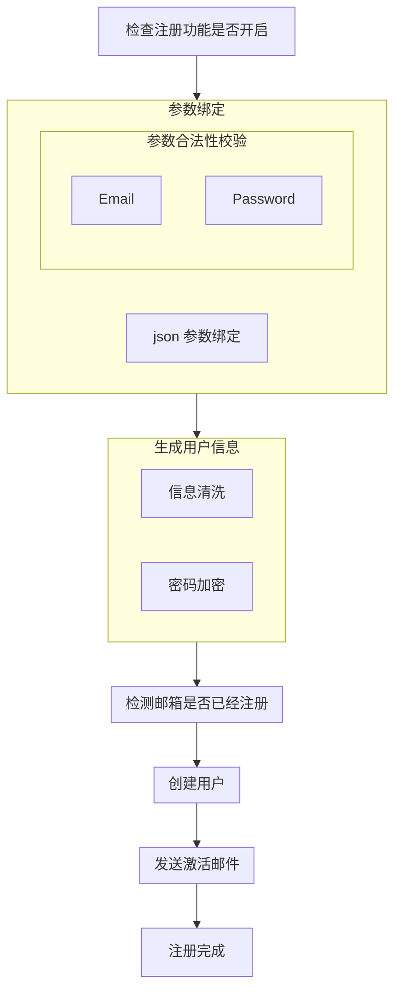

## Register

```mermaid
graph 
	A --> B --> C --> D --> E --> F --> 注册完成
	A[检查注册功能是否开启]
	
	subgraph B[参数绑定]
		BA[json 参数绑定]
        subgraph BB[参数合法性校验]
        	Email
        	Password	
        end
	end
	
	
	subgraph C[生成用户信息]
		信息清洗
		密码加密
	end
	
	subgraph D[检测邮箱是否已经注册]
	end
	
	subgraph E[创建用户]
	end
	
	subgraph F[发送激活邮件]
	end
	
```

