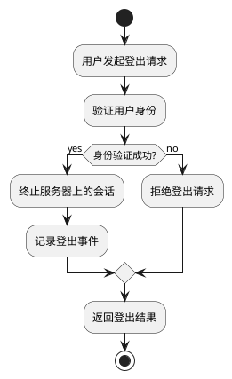

## 流程

1. **开始**：
   - 开始节点表示登出流程的开始。
2. **发起登出请求**：
   - 用户操作或系统事件触发登出流程。
3. **验证用户身份**：
   - 检查用户 session 确定用户身份
4. **终止会话**：
   - 销毁服务器上的用户会话数据，包括会话存储和任何相关的认证信息。
5. **记录登出事件**：
   - 系统记录用户的登出操作，用于安全审计。
6. **返回登出结果**：
   - 返回登出结果，包括成功或失败的信息。
7. **结束**：
   - 结束节点表示登出流程的结束。

